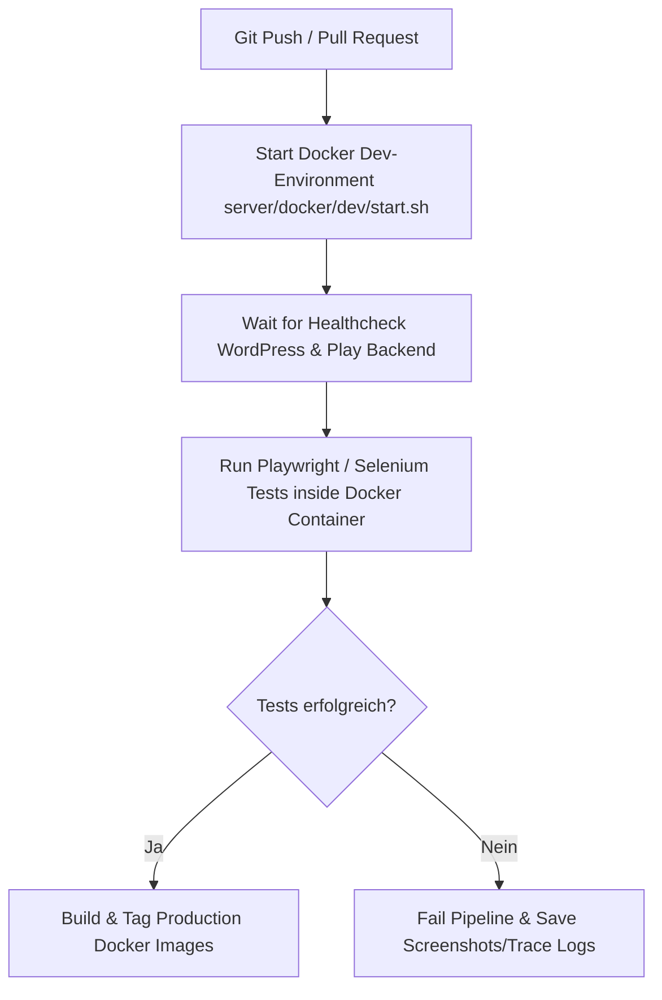

# Automatisierte Web-UI-Tests (End-to-End Testing)

Dieses Dokument beschreibt das Konzept, die Architektur, den Vergleich möglicher Test-Frameworks sowie konkrete Implementierungsbeispiele für automatisierte Web-Benutzeroberflächen-Tests (E2E-Testing) der **Playdemo / Turnier-Service Webanwendung** (Scala 3 Playframework Backend, Scala.js Frontend & WordPress-Plugin).

---

## 1. Zielsetzung & Testumfang

Das Ziel automatisierter UI-Tests ist die kontinuierliche Qualitätssicherung der Benutzeroberfläche und der Geschäftslogik im Browser.

### Relevante Test-Szenarien im Projekt:
1. **Hauptsuche (`MainSearch`):**
   - Eingabe von Suchbegriffen (Veranstalter, Turniername, Datum) und Filterung nach Sportart/Wettbewerbstyp.
   - **Rollenbasiertes Routing beim Klick auf Suchergebnisse:**
     - **Anonymer / Nicht-Admin Benutzer:** Weiterleitung auf `TourneyWelcome` bzw. `CompetitionWelcome` (Öffentlicher View-Modus).
     - **TourneyAdmin / TourneyMaster / WP-Admin:** Weiterleitung auf `TourneyInfo` bzw. `CompetitionInfo` (Verwaltungsmodus).
2. **Turnier- & Wettbewerbsansicht (`TourneyWelcome` / `CompetitionWelcome`):**
   - Prüfung der Anzeige von Turnierdetails, Karten-Vorschau (DSGVO-konform über `/srv/api/map/static`) und Teilnehmerlisten.
   - Auslösung der Online-Anmeldung (`DlgPublicRegistration`) und iCalendar-Downloads (`.ics`).
3. **Authentifizierung & Rechteverwaltung (`Auth` / `Management`):**
   - Anmelden als WordPress-Admin / Turnier-Admin.
   - Überprüfung des Navigationsleisten-Buttons „Management“.
   - Vergabe und Änderung von Turnier-Guthaben (`available`).

---

## 2. Vergleich der Test-Frameworks & Technologien

Für die Automatisierung von Web-UI-Tests stehen verschiedene Frameworks zur Verfügung.

| Kriterium | **Playwright** *(Empfohlen)* | **Selenium WebDriver** | **Cypress** |
| :--- | :--- | :--- | :--- |
| **Geschwindigkeit** | ⚡ Sehr schnell (Nativer Browser-Protokoll-Zugriff) | 🐢 Moderat (HTTP / WebDriver Protokoll) | ⚡ Schnell |
| **Auto-Waiting** | ✅ Automatisch (wartet auf DOM, Sichtbarkeit, Animationen) | ❌ Manuell (Explicit Waits / ExpectedConditions erforderlich) | ✅ Automatisch |
| **Browser-Abdeckung** | Chromium (Chrome, Edge), Firefox, WebKit (Safari) | Chrome, Firefox, Safari, Edge, Internet Explorer | Chrome, Firefox, Edge, Electron |
| **Multi-Tab / Multi-Frame**| ✅ Hervorragend unterstützt | ⚠️ Umständlich | ❌ Nicht unterstützt |
| **Netzwerk-Mocking & Interzeption** | ✅ Nativ (HTTP, WebSockets) | ⚠️ Eingeschränkt / Drittanbieter | ✅ Nativ |
| **Sprachen** | TypeScript/JavaScript, Python, Java, C# | Java, Scala, Python, C#, JavaScript, Ruby | TypeScript/JavaScript |
| **SBT / Scala Integration** | Über Node.js-Runner oder Java API | Nativ über `ScalaTest` + `selenium-java` | Über Node.js-Runner |

---

### **Empfehlung: Playwright (Node.js / TypeScript oder Python)**

**Gründe für Playwright:**
1. **Kein Flaking durch Auto-Waiting:** Playwright wartet automatisch, bis Elemente im DOM geladen, sichtbar und klickbar sind. Das verhindert sporadische Testfehler durch asynchrone AJAX/Scala.js-Renders.
2. **WebSocket- & API-Inspektion:** Da das Playframework WebSockets für Echtzeit-Spielstände nutzt, kann Playwright WebSocket-Nachrichten direkt testen.
3. **DSGVO & Netzsicherheit:** Playwright kann externe Netzwerkanfragen blockieren oder spiegeln, um DSGVO-Konformität zu überprüfen.

---

## 3. Test-Architektur: Page Object Model (POM)

Zur Vermeidung von dupliziertem Code und für hohe Wartbarkeit wird das **Page Object Model (POM)** angewendet. Jede UI-Seite erhält eine eigene Klasse, die Elemente und Interaktionen kapselt.

```
test/
├── TestInfo.md                       # Diese Dokumentation
├── e2e/                              # Playwright Test Suite (Node.js / TypeScript)
│   ├── package.json
│   ├── playwright.config.ts
│   ├── pages/                        # Page Objects
│   │   ├── MainSearchPage.ts
│   │   ├── TourneyWelcomePage.ts
│   │   ├── TourneyInfoPage.ts
│   │   └── LoginPage.ts
│   └── tests/                        # E2E Testfälle
│       ├── search_routing.spec.ts
│       ├── tourney_welcome.spec.ts
│       └── admin_management.spec.ts
```

---

## 4. Konkretes Implementierungsbeispiel 1: Playwright (TypeScript)

### **A. Page Object für `MainSearch` (`test/e2e/pages/MainSearchPage.ts`)**

```typescript
import { Page, Locator, expect } from '@playwright/test';

export class MainSearchPage {
  readonly page: Page;
  readonly inputTitle: Locator;
  readonly inputOrganizer: Locator;
  readonly radioTypeAll: Locator;
  readonly radioTypeTourney: Locator;
  readonly radioTypeComp: Locator;
  readonly resultRows: Locator;

  constructor(page: Page) {
    this.page = page;
    // Selektoren basierend auf den eindeutigen IDs der Anwendung
    this.inputTitle = page.locator('input[id*="IdInputTitle"]');
    this.inputOrganizer = page.locator('input[id*="IdInputOrganizer"]');
    this.radioTypeAll = page.locator('input[id*="RadioTypeAllId"]');
    this.radioTypeTourney = page.locator('input[id*="RadioTypeTourneyId"]');
    this.radioTypeComp = page.locator('input[id*="RadioTypeCompId"]');
    this.resultRows = page.locator('tr[id*="InputResultId"]');
  }

  async goto(baseUrl: String) {
    await this.page.goto(`${baseUrl}/#MainSearch`);
  }

  async searchByTitle(title: string) {
    await this.inputTitle.fill(title);
    // Warten auf Debounce (400ms in ScalaJS)
    await this.page.waitForTimeout(500);
  }

  async clickFirstResult() {
    await expect(this.resultRows.first()).toBeVisible();
    await this.resultRows.first().click();
  }
}
```

---

### **B. Testfall: Rollenbasiertes Routing (`test/e2e/tests/search_routing.spec.ts`)**

```typescript
import { test, expect } from '@playwright/test';
import { MainSearchPage } from '../pages/MainSearchPage';

const BASE_URL = process.env.WP_URL || 'http://localhost:8080';

test.describe('MainSearch Rollenbasiertes Routing', () => {

  test('Anonymer Benutzer wird auf TourneyWelcome weitergeleitet', async ({ page }) => {
    const searchPage = new MainSearchPage(page);

    // 1. Suche aufrufen
    await searchPage.goto(BASE_URL);

    // 2. Nach Turnier suchen
    await searchPage.searchByTitle('Sommerturnier');

    // 3. Erstes Ergebnis anklicken
    await searchPage.clickFirstResult();

    // 4. Erwartung: Weiterleitung auf TourneyWelcome (Öffentlicher View-Modus)
    await expect(page.locator('.card-header:has-text("Willkommen")')).toBeVisible();
    await expect(page).toHaveURL(/.*#TourneyWelcome/);
  });

  test('Angemeldeter TourneyAdmin wird auf TourneyInfo weitergeleitet', async ({ page }) => {
    // 1. Login als Admin durchführen
    await page.goto(`${BASE_URL}/wp-login.php`);
    await page.fill('#user_login', 'admin');
    await page.fill('#user_pass', 'password123');
    await page.click('#wp-submit');

    const searchPage = new MainSearchPage(page);

    // 2. Suche aufrufen
    await searchPage.goto(BASE_URL);

    // 3. Nach eigenem Turnier suchen
    await searchPage.searchByTitle('Sommerturnier');
    await searchPage.clickFirstResult();

    // 4. Erwartung: Weiterleitung auf TourneyInfo (Verwaltungs-Modus mit Bearbeiten-Buttons)
    await expect(page.locator('button:has-text("Turnier bearbeiten")')).toBeVisible();
    await expect(page).toHaveURL(/.*#TourneyInfo/);
  });

});
```

---

## 5. Konkretes Implementierungsbeispiel 2: Selenium (Scala & ScalaTest)

Falls die UI-Tests nativ im SBT-Build mit Scala ausgeführt werden sollen, kann `ScalaTest` in Kombination mit `Selenium` verwendet werden.

### **A. Abhängigkeiten in `build.sbt` hinzufügen:**

```scala
libraryDependencies ++= Seq(
  "org.scalatest"          %% "scalatest"          % "3.2.18" % Test,
  "org.scalatestplus"      %% "selenium-4-12"      % "3.2.18.0" % Test,
  "org.seleniumhq.selenium" % "selenium-java"      % "4.18.1"  % Test
)
```

### **B. ScalaTest Selenium Testfall (`test/scala/MainSearchSpec.scala`):**

```scala
import org.scalatest.funspec.AnyFunSpec
import org.scalatest.matchers.should.Matchers
import org.scalatestplus.selenium.WebBrowser
import org.openqa.selenium.chrome.ChromeOptions
import org.openqa.selenium.WebDriver
import org.openqa.selenium.chrome.ChromeDriver

class MainSearchSpec extends AnyFunSpec with Matchers with WebBrowser {

  val baseUrl = sys.env.getOrElse("WP_URL", "http://localhost:8080")

  implicit val webDriver: WebDriver = {
    val options = new ChromeOptions()
    options.addArguments("--headless=new")
    options.addArguments("--no-sandbox")
    options.addArguments("--disable-dev-shm-usage")
    new ChromeDriver(options)
  }

  describe("MainSearch UI Tests") {

    it("soll anonymer Benutzer beim Klick auf ein Turnier zu TourneyWelcome leiten") {
      go to s"$baseUrl/#MainSearch"
      
      // Suchfeld befüllen
      textField(cssSelector("input[id*='IdInputTitle']")).value = "Sommerturnier"
      
      // Warten auf AJAX Ergebnistabelle
      eventually {
        find(cssSelector("tr[id*='InputResultId']")).isDefined should be (true)
      }

      // Klick auf das erste Suchergebnis
      click on cssSelector("tr[id*='InputResultId']")

      // Verifizierung der Zielseite
      eventually {
        currentUrl should include ("#TourneyWelcome")
        pageTitle should include ("Turnier")
      }
    }
  }
}
```

---

## 6. Docker & CI/CD Pipeline Integration

Damit UI-Tests automatisch vor jedem Deployment oder in CI/CD-Pipelines (z.B. GitHub Actions) ausgeführt werden können, empfiehlt sich die Headless-Ausführung im Docker-Container.

### **Automatisierter Ablauf in CI/CD:**



### **Beispiel GitHub Actions Workflow (`.github/workflows/ui-tests.yml`):**

```yaml
name: Web UI Automation Tests

on:
  push:
    branches: [ tourney, main ]
  pull_request:
    branches: [ tourney, main ]

jobs:
  ui-tests:
    runs-on: ubuntu-latest

    steps:
      - name: Checkout Code
        uses: actions/checkout@v4

      - name: Setup Java & SBT
        uses: actions/setup-java@v4
        with:
          distribution: 'temurin'
          java-version: '21'

      - name: Start Docker Environment
        run: |
          cd server/docker/dev
          ./start.sh
          # Warten bis WordPress und Backend bereit sind
          sleep 15

      - name: Install Node.js & Playwright
        uses: actions/setup-node@v4
        with:
          node-version: '20'

      - name: Run Playwright UI Tests
        run: |
          cd test/e2e
          npm ci
          npx playwright install --with-deps
          npx playwright test

      - name: Upload Test Artifacts (on Failure)
        if: failure()
        uses: actions/upload-artifact@v4
        with:
          name: playwright-report
          path: test/e2e/playwright-report/
```

---

## 7. Best Practices für dieses Projekt

1. **Stabile HTML-Element-IDs:**
   - In der Scala.js-Architektur werden HTML-IDs über `genId(name)` dynamisch generiert (z. B. `MainSearch-IdInputTitle-123`).
   - In den UI-Tests sollten daher Selektoren mit Prefix/Wildcard genutzt werden:
     - CSS: `input[id*="IdInputTitle"]` oder `[data-testid="search-title"]`
2. **Isolierte Testdaten:**
   - Vor der Testausführung das Test-Setup-Skript (`server/docker/dev/setup.sh`) oder ein Datenbank-Reset-Skript ausführen, um definierte Test-Turniere bereitzustellen.
3. **Screenshot- & Video-Capturing bei Fehlern:**
   - Playwright zeichnet bei fehlgeschlagenen Tests automatisch Videos und Traces auf, die in `playwright-report/` als Artefakt gespeichert werden.
